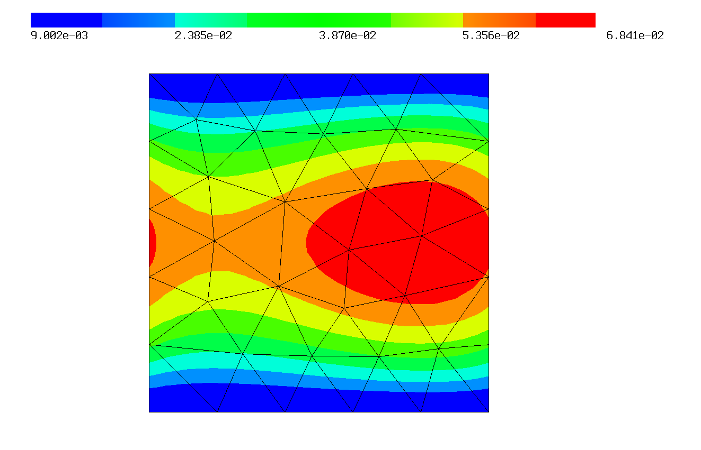
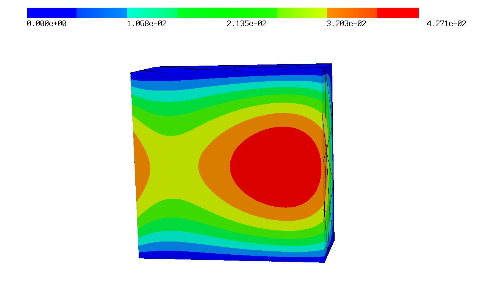

Periodicity
===========

Netgen is able to create periodic meshes, with them NGSolve can create periodic finite element spaces by mapping the degrees of freedom on the slave boundary to the ones on the master boundary. To use this functionality create a periodic mesh first:

.. _CSGeometry.PeriodicSurfaces:

Periodic Meshes
---------------

3D
^^^

If a geometry object has a periodic identification, Netgen creates a periodic mesh for the specified surfaces. In 3 dimensions, this identification is created using CSGeometry.PeriodicSurfaces(master,slave). Here we define a cube with periodicity in x-direction and create a periodic NGSolve mesh for it:

.. literalinclude:: res_periodic/periodic3D.py
   :end-before: fes = 

2D
^^^

In two dimensions you can create periodic geometries with the copy parameter of the SplineGeometry.Append method. This defines the appended spline as the slave of the one given in ``copy``:

.. caution:: The slave boundaries must be defined in the same direction as the master ones!
             
.. literalinclude:: res_periodic/periodic2D.py
   :end-before: fes = 

1D
^^^

In one dimension you can add periodic identifications to points (This is not necessary for mesh creation of course, but lets NGSolve find the periodic vertices the same way as it finds the ones in higher dimensions). The added point numbers must be the ones returned from ``mesh.Add(MeshPoint)``. This is a :ref:`manually created mesh <manual-mesh-generation>` with periodic boundaries:

.. literalinclude:: res_periodic/periodic1D.py

Periodic FESpace
----------------

The periodic finite element space is created using the generator function Periodic. A quasi-periodic space can be created the same way if the optional parameter 'phase' is set.

.. caution:: The phase shifts must be given in the same order as the definition of the periodic boundaries in the geometry!
             
We can solve a periodic problem using the above defined mesh:

.. literalinclude:: res_periodic/periodic3D.py
   :start-after: mesh =
   :end-before: from ngsolve.internal

The solution of this problem plotted in 2D and in 3D:

.. caution:: Since the dofs are mapped to the other side, periodic spaces are not possible on meshes
             with only one element in the direction of the periodic boundaries (then the
             elementmatrix would need to be of different size and NGSolve cannot handle that). So make
             sure that the meshsize is less than half your domain width!
           
You can download these examples here: :download:`1D<res_periodic/periodic1D.py>`, :download:`2D<res_periodic/periodic2D.py>`, :download:`3D<res_periodic/periodic3D.py>`.

Function Documentation
----------------------

.. autofunction:: ngsolve.Periodic
		
   
.. automodule:: ngsolve
                :members:
