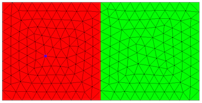

Define and mesh 2D geometries
==============================

Netgen-python allows to define 2D geometries by means of boundary curves. Curves can be lines, or rational splines of 2nd order.

.. code-block:: python

   import netgen.geom2d as geom2d

We generate a geometry object, and add geometry control points:

.. code-block:: python

   geo = geom2d.SplineGeometry()
   p1 = geo.AppendPoint (0,0)
   p2 = geo.AppendPoint (1,0)
   p3 = geo.AppendPoint (1,1)
   p4 = geo.AppendPoint (0,1)

p1 to p4 are indices referring to these points. Next, we add the 4 sides of the square:

.. code-block:: python

   geo.Append (["line", p1, p2])
   geo.Append (["line", p2, p3])
   geo.Append (["line", p3, p4])
   geo.Append (["line", p4, p1])

The lines are oriented such that the domain is on the left side when going from the first point to the second point of the line.

We generate a mesh, where the maxh arguments specifies the desired maximal global mesh-size.

.. code-block:: python

   mesh = geo.GenerateMesh (maxh=0.1)

You can iterate over points and elements of the mesh:

.. code-block:: python
                
   for p in mesh.Points():
    x,y,z = p.p
    print ("x = ", x, "y = ", y)
    for el in mesh.Elements2D():
      print (el.vertices)

Curved boundaries
-----------------

Instead of line segments, we can use second order rational splines, which give an exact representation of ellipses. They are described by three points defining the control polygon. The curve and its tangential direction coincides with the control polygon at the start and the end-point.

The following defines a quarter of a circle:

.. code-block:: python

   geo = geom2d.SplineGeometry()
   p1,p2,p3,p4 = [ geo.AppendPoint(x,y) for x,y in [(0,0), (1,0), (1,1), (0,1)] ]
   geo.Append (["line", p1, p2])
   geo.Append (["spline3", p2, p3, p4])
   geo.Append (["line", p4, p1])

Multiple subdomains
-------------------

As default, the domain is left of the segment. If you have several subdomains, you specify the subdomain numbers left and right of the segment. Outside is given as subdomain number 0. Default values for leftdomain and rightdomain are 1 and 0, respectively. The following example gives two squares:

.. code-block:: python

   geo = geom2d.SplineGeometry()
   p1,p2,p3,p4 = [ geo.AppendPoint(x,y) for x,y in [(0,0), (1,0), (1,1), (0,1)] ]
   p5,p6 =  [ geo.AppendPoint(x,y) for x,y in [(2,0), (2,1)] ]
   geo.Append (["line", p1, p2], leftdomain=1, rightdomain=0)
   geo.Append (["line", p2, p3], leftdomain=1, rightdomain=2)
   geo.Append (["line", p3, p4], leftdomain=1, rightdomain=0)
   geo.Append (["line", p4, p1], leftdomain=1, rightdomain=0)
   geo.Append (["line", p2, p5], leftdomain=2, rightdomain=0)
   geo.Append (["line", p5, p6], leftdomain=2, rightdomain=0)
   geo.Append (["line", p6, p3], leftdomain=2, rightdomain=0)

The obtained mesh looks like below. You get the red color by double-clicking into the subdomain.

   
Boundary condition markers
---------------------------

You can specify a boundary condition number for each segment, which can be used to specify boundary conditions in the simulation software. It must be a positive integer.

.. code-block:: python
                
   geo.Append (["line", p1, p2], bc=3)

New features since Nov 2, 2015:
--------------------------------

You can set segment-wise and domain-wise maximal mesh-size:

.. code-block:: python

   geo.Append (["line", p1, p2], maxh=0.1)
   geo.SetDomainMaxH(2, 0.01)

You can give labels for boundary conditions and domains materials:

.. code-block:: python

   geo.Append (["line", p1, p2], bc="bottom")
   geo.SetMaterial(2, "iron")

You have templates for defining circles and rectangles:

.. code-block:: python

   geo.AddCircle(c=(5,0), r=0.5, leftdomain=2, rightdomain=1)
   geo.AddRectangle((0,0), (3,2))

New feature since Nov 26, 2015:
--------------------------------

Generation of quad-dominated 2D meshes:

.. code-block:: python

   geo.GenerateMesh(maxh=..., quad_dominated=True)

   
