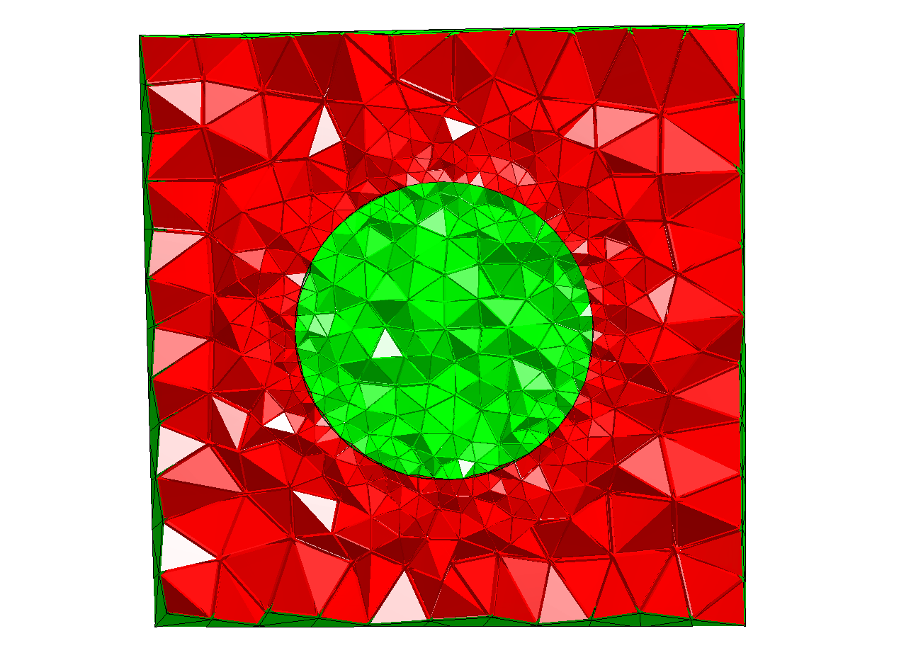
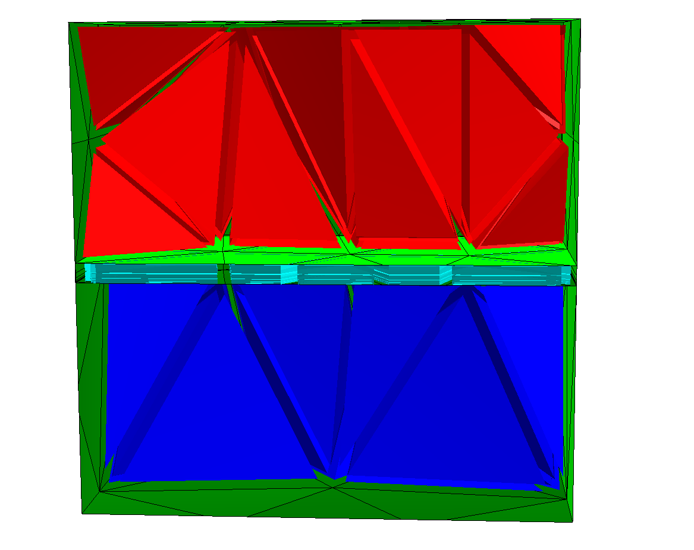

Mesh Size and Refinement
==========================

CSGeometry
-----------

Local Mesh Size
^^^^^^^^^^^^^^^^^

Local mesh sizes of boundaries are given to the solid object itself, you can set the volume
mesh size when adding them to the geometry object:

.. literalinclude:: res_meshsize/csg_localmeshsize.py

Anisotropic Meshes
^^^^^^^^^^^^^^^^^^^

Netgen can create anisotropic meshes, using the close surface identification. It will fill
the layer with prisms, which can be sliced. This is best explained in an example:

.. literalinclude:: res_meshsize/closesurface_plate.py

