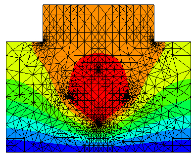

Adaptive mesh refinement
========================

We are solving a stationary heat equation with highly varying coefficients. 
This example shows how to
 
* model a 2D geometry be means of line segments
* apply a Zienkiewicz-Zhu type error estimator. The flux is interpolated into an H(div)-conforming finite element space.
* loop over several refinement levels

Download: :download:`adaptive.py </../py_tutorials/adaptive.py>`

.. literalinclude:: /../py_tutorials/adaptive.py

The solution on the adaptively refined mesh, and the convergence plot from matplotlib:

.. image:: res_adaptive/adaptive_err.png

