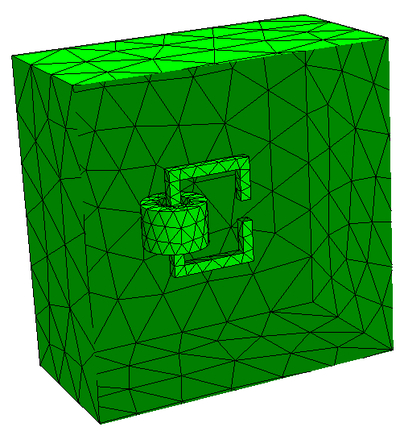
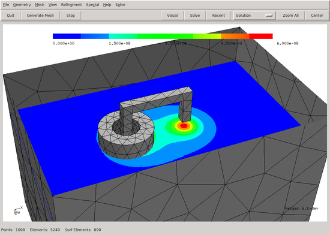

.. _whetting-cmagnet:

Symbolic definition of forms : magnetic field
=============================================

We compute the magnetic field generated by a coil placed on a
C-core. We see how to

* model a 3D constructive solid geometry
* set material properties from domain and boundary labels
* define bilinear- and linear forms symbolically using trial- and testfunctions

Download  :download:`cmagnet.py</../py_tutorials/cmagnet.py>`

.. literalinclude:: /../py_tutorials/cmagnet.py

Mesh and magnitude of magnetic field visualized in Netgen:

