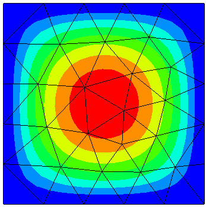

Poisson equation
================

We solve the Poisson equation on the unit-square, with homogeneous Dirichlet boundary conditions. You can run the :download:`example</../py_tutorials/poisson.py>` either directly within the Python interpreter (Python version 3 is required!):

.. code:: bash
   
   python3 poisson.py

or you can run it with Netgen providing you also a graphical user interface

.. code:: bash
   
   netgen poisson.py

.. literalinclude:: /../py_tutorials/poisson.py
.. :start-after: ngsglobals.msg_level = 1

The solution visualized in Netgen:

